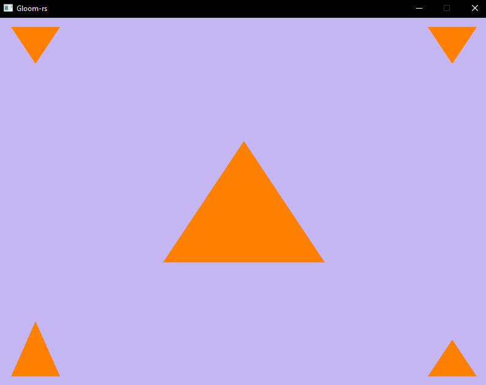
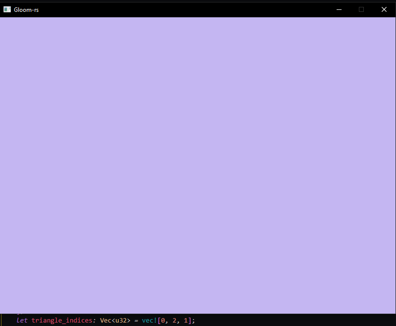

---
# These are meta-variables defined with YAML syntax, change them as you wish.
# see https://pandoc.org/MANUAL.html#variables
title: TDT4195 Assignment 2
author:
  - Jørgen Aleksander Fagervik
date: \today # This is a latex command, ignored for HTML output
lang: en-US
papersize: a4
geometry: margin=4cm
toc: false
toc-title: 'List of Contents'
toc-depth: 2
numbersections: true
colorlinks: true
links-as-notes: true
# The document is following the break written using Markdown syntax
---

# TDT4195: Visual Computong Dundamentals

## Computer Graphics Assignment 1

1.  

2.  a)

i) The name of this phenomenon is clipping.
ii) It occurs after the assembly and vertex shader(simple.vert in this case) stages.
iii) The purpose of this is to discard/remove the primitives where vertices are outside bounds (normailized space viewing volume). The ones that are inside go through to the next stage in the pipeline. I knew that openGL uses a coordinate system for [-1.0,1.0] for all axes, and "manully clipping" the coordinates above or below the bounds made the shape now look like a triangle.

b) 

i) The triangle completely disappears if I give it the index buffer [1, 0, 2], [0, 2, 1] or [2, 1, 0]
ii) It happens due to
iii) The effect occurs when the indices 0 2 and 1 come after each other, despite which one you start from. The rule is that "".

c)
i) The reason that the depth buffer needs to be reset each frame is to avoid comparing the new pixels with the depth values from last frame.
ii)
iii) Fragment/pixel shader, which is responsible for giving colors to each pixel. The second common shader is the vertex shader, which is responsible for determining positions of elements on the screen.
iv) The index buffer is used to optimize how we draw shapes. We use triangles in graphics since it requires the least amounts of vertices to achive a plane with a normal,
and lets say we want to draw a square: then we can use two of our previous vertices to draw it. we use bottom left and top right again, and only need to specify top left.
Index buffer for this would be [0, 1, 2, 2, 3, 0]. we now need less vertices.
v) We would pass in a non zero pointer when we want to start from an offset in our buffer. Perhaps our buffer contains other information prior to the vertex info.
How would I call VertexAttribPointer

3.  
    

Also have commented out how I used uniform variable to change the color of the drawn triangle(s)/square, but this isn't quite stable and crashes "randomly".
