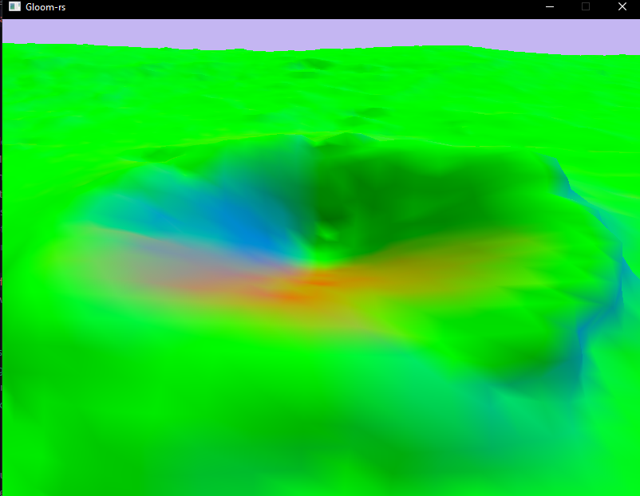
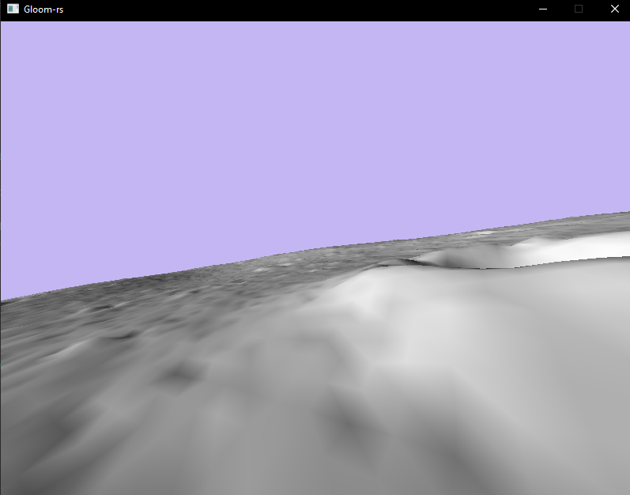
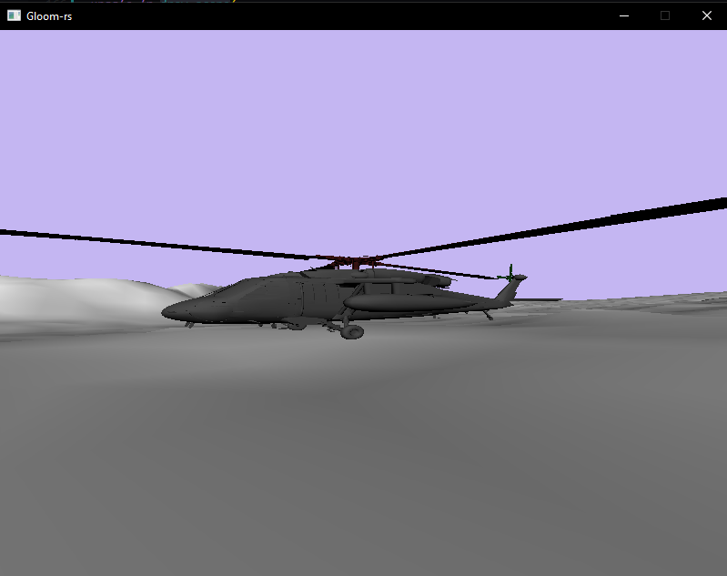
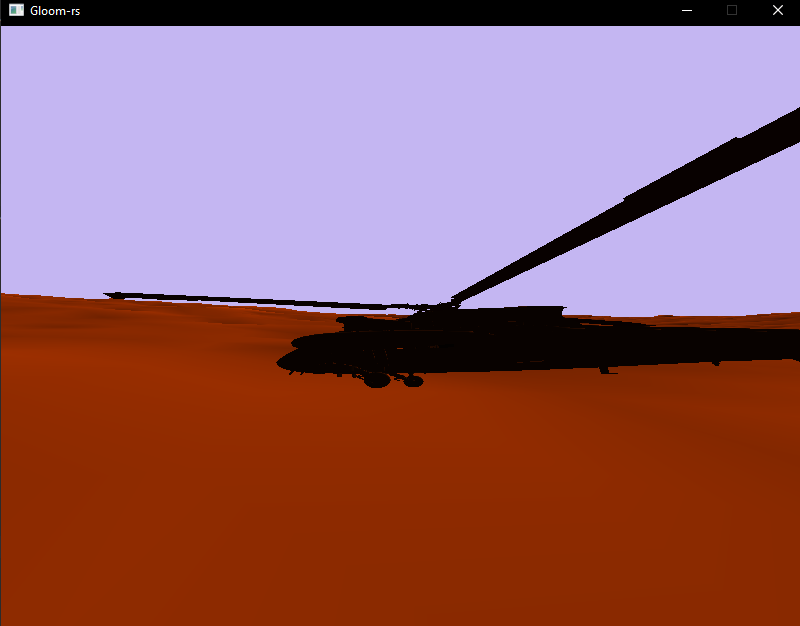
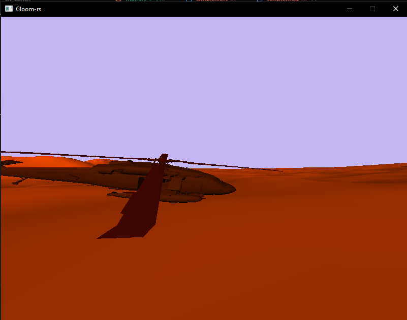
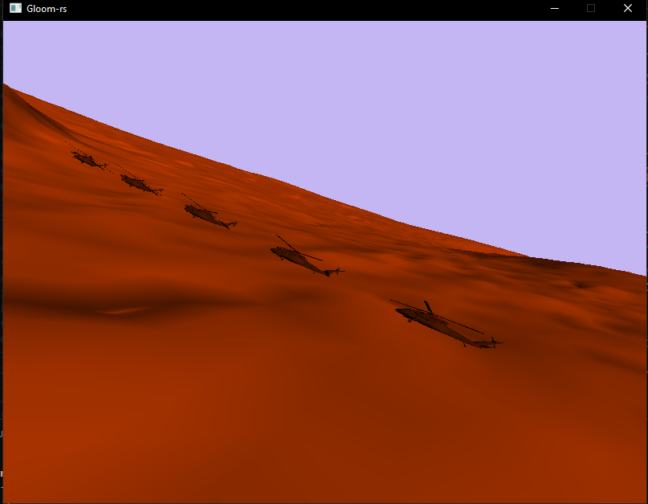

---
# These are meta-variables defined with YAML syntax, change them as you wish.
# see https://pandoc.org/MANUAL.html#variables
title: TDT4195 Assignment 3
author:
  - Jørgen Aleksander Fagervik
date: \today # This is a latex command, ignored for HTML output
lang: en-US
papersize: a4
geometry: margin=4cm
toc: false
toc-title: 'List of Contents'
toc-depth: 2
numbersections: true
colorlinks: true
links-as-notes: true
# The document is following the break written using Markdown syntax
---

# TDT4195: Visual Computing Fundamentals

## Task 1

c)

d)

## Task 2

## Task 5

a)

c)

## Task 6

