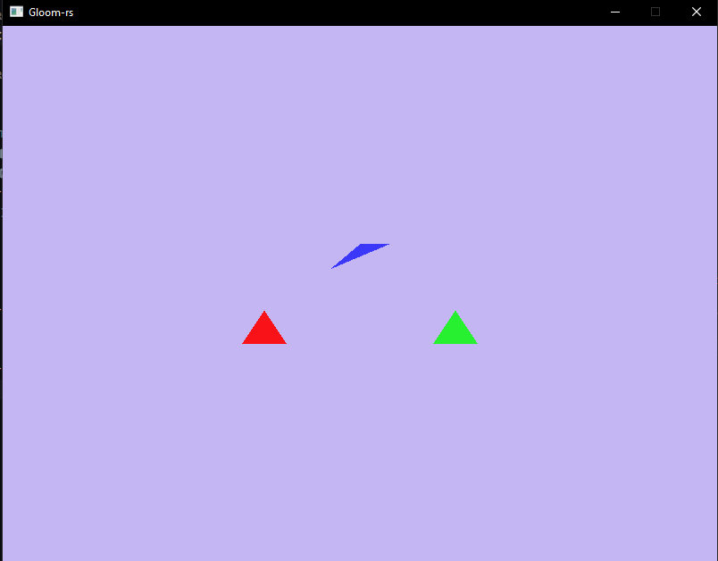
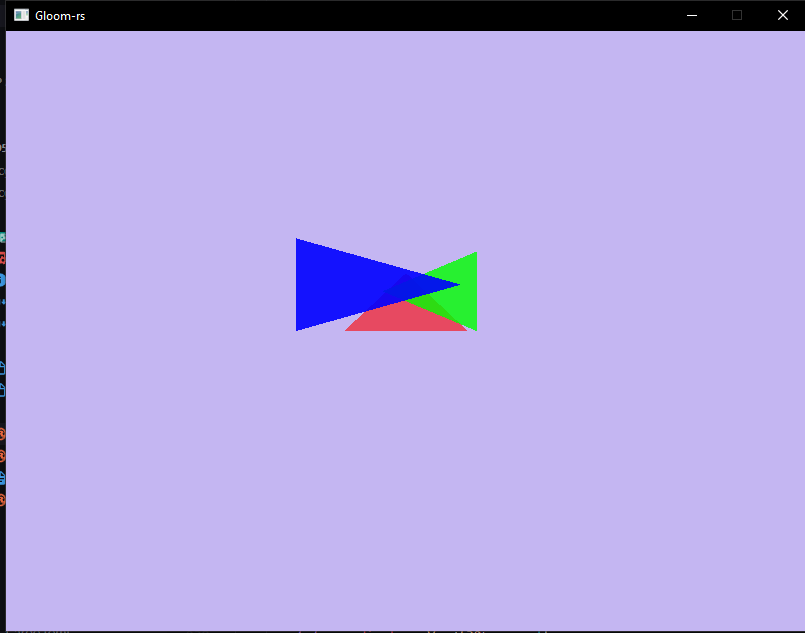
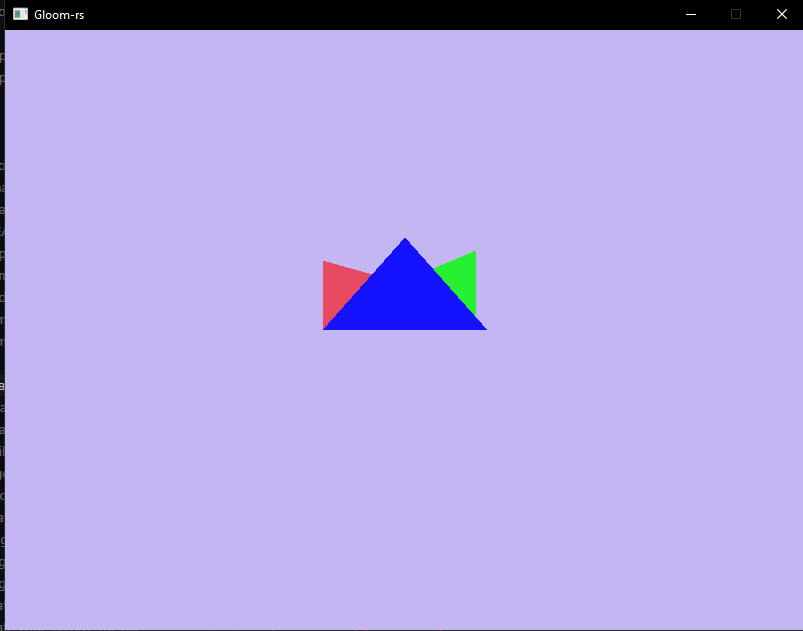

---
# These are meta-variables defined with YAML syntax, change them as you wish.
# see https://pandoc.org/MANUAL.html#variables
title: TDT4195 Assignment 2
author:
  - Jørgen Aleksander Fagervik
date: \today # This is a latex command, ignored for HTML output
lang: en-US
papersize: a4
geometry: margin=4cm
toc: false
toc-title: 'List of Contents'
toc-depth: 2
numbersections: true
colorlinks: true
links-as-notes: true
# The document is following the break written using Markdown syntax
---

# TDT4195: Visual Computing Fundamentals 

## Exercise 1
b) 3 different triangles with different z-indices and colors

## Exercise 2
a) Images of alpha blending

b) 
i) At first, the colors of the triangles with higher z index seem to get higher priority in the blending. Te diffreence in opacity lets us see which colors dominate most in the blending. When I put my green triangle to the back, which have opacity closer to one, the blended color seems to be more mixed. 
ii) For the z index, things started to change. We're no longer drawing back to front, and since blue has lowest z index, and lowest opacity, it does not seem to get blended at all actually. Even though red triangle has higher z index than green, it "appears" to have been drawn behind, due to greens almost non-transparent value. Green is drawn last, but red dominates the blending due to higher z index.

## Exercise 3
b) 
a = scale, gets smaller the lesser the value | axis = x.
b = shear | axis = y.
c = translation, to right | axis = Translation does not directly correspond to one specific axis as the first tree columns do.
d = shear, looked like right side got turnt more up | axis = x.
e = scale, height | axis = y.
f = translates upwards | axis = Translation does not directly correspond to one specific axis as the first tree columns do. 

c) To have rotation we have to have [cos ø, sin ø]^T , [-sin ø, cos ø]^T in some way or another in the matrix. For Rot_x, e doesn't have to be 1, and sin ø and - sin ø doesn't both give 0. Rot_y: sin has to be 0, and cos ø be 1. aVal corresponds to cos ø, and -sin to 0. e val must be 1, but a val and e val can both be other numbers, so hard to get Rot_z: d and f would have to be 0. a, b, d and e all have to match the rotation pattern.
In short, there are no way as the matrix is now that could force all the 4 values needed to correspond to a rotation.

## Exercise 4
See code, we now have something that resembles a low budget Unity or Unreal engine. 